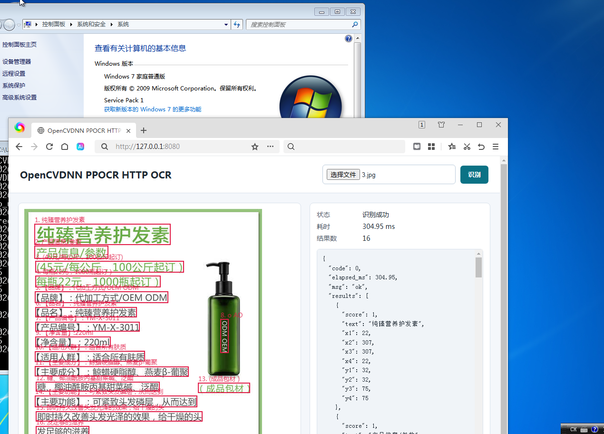
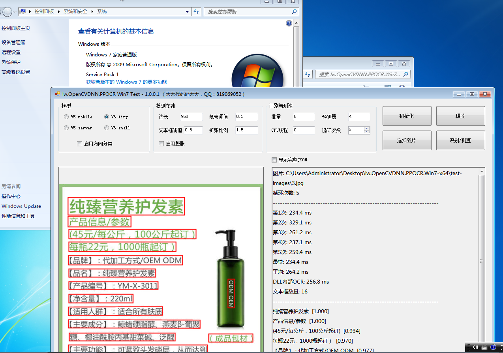

# lw.OpenCVDNN.PPOCR

[](LICENSE)
[](https://github.com/lxw112190/lw.OpenCVDNN.PPOCR/releases)

**14 MB pure-CPU PP-OCR DLL. .NET Framework 3.5-ready. No runtime installation. Runs on Windows 7.**

> 中文版：[README_zh.md](README_zh.md)

- **Author:** 天天代码码天天 &nbsp;|&nbsp; **QQ:** 819069052
- **QQ Group:** C# 人工智能实践 &nbsp;|&nbsp; **群号:** 758616458
- **Target OS:** Windows 7 SP1 or later (x64 recommended; x86 package also provided)

> **Distribution model:** This is a mixed source/binary SDK. The HTTP server,
> public headers, and examples are provided as source under MIT. The native OCR
> engine is distributed as a pre-built binary; its C++ source is not included.
> See [DISTRIBUTION.md](DISTRIBUTION.md) for the exact scope.

---

## Why This Exists

Many people assume Windows 7 left the mainstream, so it must have left the factory floor. The reality is different.

Industrial PCs, production-line terminals, inspection equipment, and legacy business systems are still running Windows 7 — stable, costly to replace, and tied to .NET Framework 3.5 host software. You can't casually upgrade the OS, and you can't install a chain of runtimes.

**What these devices actually need is not the most complex tech stack. They need:**

- Keep the existing Windows and host software untouched.
- No Python. No CUDA. No GPU driver dance.
- Unzip and run. Offline deployment.
- C# applications targeting .NET Framework 3.5 can call it directly. Other
  languages with C FFI support can use the same C ABI.
- Clear logs, model paths, and initialization diagnostics when things go wrong.

`lw.OpenCVDNN.PPOCR` is an engineered answer to exactly these constraints.

## At a Glance

| | |
|---|---|
| **Engine** | OpenCV 5 DNN (CPU) |
| **OCR Models** | PP-OCRv5 / PP-OCRv6 tiny / PP-OCRv6 small |
| **Native Component** | x64 C++ DLL, ~14 MB; x86 DLL, ~10 MB |
| **C# Target** | .NET Framework 3.5 |
| **Deployment** | Direct DLL call / HTTP service / Windows service |
| **Model Paths** | UTF-16, Chinese directories supported |
| **External Runtimes** | None — no OpenCV DLLs, no VC++ redist, no Python, no CUDA |

## Comparison

Different tools have different strengths. The question here is not "which one wins everywhere" — it's which fits legacy, offline, dependency-constrained industrial equipment.

| Approach | Typical Deployment Dependencies | Win7 & Old .NET | GPU Required | Best For |
|---|---|---|---|---|
| Python + PaddleOCR | Python, PaddlePaddle & third-party packages | Usually needs process/HTTP bridge | Optional | R&D validation; heavy to deploy on the line |
| OpenCvSharp + OpenCV | Managed bindings + native OpenCV libs | Needs compatible version | No | Convenient C# dev; more moving parts |
| ONNX Runtime | ONNX Runtime shared libraries | Depends on runtime version & wrapper | Optional | General-purpose; extra runtime to maintain |
| TensorRT | CUDA, cuDNN, TensorRT & drivers | Not suitable for non-NVIDIA | **Required** | Max speed on NVIDIA hardware |
| **This project** | **DLL + models + dictionary** | **.NET Framework 3.5 wrapper + C ABI** | **No** | **Pure CPU, self-contained deployment, long-life industrial software** |

OpenCV DNN may not be the fastest on every piece of hardware. Its advantage is fewer dependencies, a stable interface, a standard ONNX model format, and a clean deployment path — exactly what long-maintenance-cycle industrial software needs.

## Call Chain

```text
JPG / PNG / BMP image
      │
      ├── C#, C++ etc. pass raw image bytes
      └── HTTP client sends Base64
                  │
                  ▼
       lw.OpenCVDNN.PPOCR.dll
                  │
         OpenCV 5 DNN CPU inference
                  │
      Text detection → Perspective crop → Angle classification (optional) → Recognition
                  │
                  ▼
 UTF-8 JSON: text, confidence, 4-point boxes, OCR elapsed time
```

## What's in the Box

```text
lw.OpenCVDNN.PPOCR.Win7-x64/
  LICENSE, DISTRIBUTION.md                Project license and distribution scope
  THIRD_PARTY_NOTICES.md, licenses/       Third-party notices and license texts
  lw.OpenCVDNN.PPOCR.dll                 OCR native DLL (~14 MB, self-contained)
  lw.OpenCVDNN.PPOCR.HttpServer.exe      HTTP server
  lw.OpenCVDNN.PPOCR.Win7.Test.exe       .NET Framework 3.5 WinForms test app
  inference/                             PP-OCR ONNX models & dictionaries
  www/                                   Browser test page
  deploy/                                Windows service install / uninstall scripts
  sdk/
    native/                              DLL, import library, ppocr_api.h
    csharp/                              NativeOcr.cs reference wrapper
    SDK_INTEGRATION.md                   Multi-language integration guide
  test-images/                           Sample images
  start_console.bat                      One-click HTTP server
  start_winforms_test.bat                One-click WinForms test
```

The x64 package contains every model listed below. The low-memory x86 package
contains PP-OCRv6 tiny only.

## Screenshots

HTTP OCR web UI running on Windows 7 SP1:



.NET Framework 3.5 WinForms test and benchmark application on Windows 7 SP1:



## How We Made Win7 Work

"Supporting Windows 7" is not just changing a build flag. If any layer pulls in a higher-version dependency, the binary fails silently or crashes on the target machine.

### 1. OpenCV 5 built from source

The native engine was built against OpenCV 5.0.0 from source with Visual Studio 2019's MSVC v142 toolset. This public repository does not include the OpenCV source/static-library build tree or the native engine C++ source. v142 satisfies OpenCV 5's C++17 requirement while remaining more Win7-compatible than VS2022's v143.

### 2. Explicit Windows 7 subsystem target

Both the C++ DLL and HTTP server enforce:

```
WINVER=0x0601
_WIN32_WINNT=0x0601
PE Subsystem Version = 6.01
```

6.01 is Windows 7. This constrains the target at compile and link time, preventing accidental use of newer Windows APIs.

### 3. Static linking — OpenCV and C++ runtime

OpenCV 5 modules are linked as static libraries. The MSVC runtime uses `/MT` (static). The resulting `lw.OpenCVDNN.PPOCR.dll` imports **only two system DLLs**:

```
KERNEL32.dll
ole32.dll
```

No `opencv_world500.dll`. No `VCRUNTIME140.dll`. Less to go wrong.

### 4. .NET Framework 3.5 C# layer

The primary test app targets .NET Framework 3.5 x64 explicitly, and a matching
x86 build is included in the x86 package. C# calls the DLL via P/Invoke against
a stable C ABI — no OpenCvSharp, no NuGet packages. Model paths and errors use
UTF-16; OCR results use UTF-8 JSON. Chinese directory names and Chinese
recognition output both work.

### 5. No GPU dependency

Win7 industrial PCs have inconsistent GPU models, driver versions, and CUDA environments. This release is CPU-only. GPU code paths and parameters are removed. No CUDA, cuDNN, DirectML, or OpenVINO runtimes needed.

### 6. Self-contained, copy-and-run project

The public SDK keeps the open-source HTTP server and examples together with ready-to-run binaries, models, test images, and integration files. The EXE locates `inference/` and `www/` relative to its own path — it does not depend on the current working directory. Chinese installation paths are supported.

> **Note:** Different Win7 machines have different patch levels, CPU instruction sets, and system components. The project is built for Win7 SP1 x64 with controlled dependencies. Always validate on the actual target hardware or a matching image before production deployment.

## Quick Start

### 1. Download

Get the latest `win-x64` or `win-x86` package from [Releases](https://github.com/lxw112190/lw.OpenCVDNN.PPOCR/releases).

### 2. Run the HTTP Server

For local-only access, start it with an explicit loopback binding:

```bat
lw.OpenCVDNN.PPOCR.HttpServer.exe --host 127.0.0.1 --port 8080
```

Open `http://127.0.0.1:8080/`, upload an image, click **识别** (Recognize).

`start_console.bat` and the service installation script use the default
`0.0.0.0` binding so that trusted LAN clients can connect.

> **Security:** the server defaults to `0.0.0.0` and does not provide
> authentication or TLS. Use `--host 127.0.0.1` for local-only access. Expose
> it only on a trusted LAN, or place it behind an authenticated HTTPS reverse
> proxy and an appropriate firewall.

### 3. Windows Service

Run as Administrator:

```bat
deploy\install_service.bat
```

Uninstall:

```bat
deploy\uninstall_service.bat
```

## API

### HTTP Endpoint

```http
POST /api/ocr
Content-Type: application/json

{"imageBase64": "data:image/jpeg;base64,..."}
```

### curl

```bash
curl -X POST "http://127.0.0.1:8080/api/ocr" \
  -H "Content-Type: application/json" \
  -d '{"imageBase64":"...base64 content..."}'
```

### JavaScript (Browser)

```js
const response = await fetch("http://127.0.0.1:8080/api/ocr", {
  method: "POST",
  headers: { "Content-Type": "application/json" },
  body: JSON.stringify({ imageBase64 })
});
const result = await response.json();
console.log(result.elapsed_ms, result.results);
```

Run this from the bundled web UI or another same-origin page. Cross-origin
browser calls require a proxy that supplies an appropriate CORS policy.

### Response Format

```json
{
  "code": 0,
  "msg": "ok",
  "elapsed_ms": 165.328,
  "results": [
    {
      "text": "纯臻营养护发素",
      "score": 1.0,
      "x1": 22, "y1": 32,
      "x2": 307, "y2": 32,
      "x3": 307, "y3": 75,
      "x4": 22, "y4": 75
    }
  ]
}
```

### C# (.NET Framework 3.5) — Full Example

<details>
<summary>Show the complete C# example</summary>

```csharp
using System;
using System.IO;
using System.Runtime.InteropServices;
using System.Text;

class Program
{
    [StructLayout(LayoutKind.Sequential, CharSet = CharSet.Unicode)]
    private struct PpocrConfig
    {
        public int struct_size;
        [MarshalAs(UnmanagedType.LPWStr)] public string det_model_path;
        [MarshalAs(UnmanagedType.LPWStr)] public string rec_model_path;
        [MarshalAs(UnmanagedType.LPWStr)] public string rec_dict_path;
        [MarshalAs(UnmanagedType.LPWStr)] public string cls_model_path;
        public int limit_side_len;
        public double det_db_thresh;
        public double det_db_box_thresh;
        public double det_db_unclip_ratio;
        public int use_dilation;
        public int use_angle_cls;
        public double cls_thresh;
        public int cls_batch_num;
        public int rec_batch_num;
        public int rec_img_h;
        public int rec_img_w;
        public int rec_predictor_num;
        public int cpu_threads;
    }

    private const string DllName = "lw.OpenCVDNN.PPOCR.dll";

    [DllImport(DllName, CallingConvention = CallingConvention.Cdecl)]
    private static extern void ppocr_config_init(ref PpocrConfig config);

    [DllImport(DllName, CallingConvention = CallingConvention.Cdecl, CharSet = CharSet.Unicode)]
    private static extern int ppocr_create_ex_w(ref PpocrConfig config,
        out IntPtr engine, StringBuilder error, int errorCapacity);

    [DllImport(DllName, CallingConvention = CallingConvention.Cdecl, CharSet = CharSet.Unicode)]
    private static extern int ppocr_ocr_encoded(IntPtr engine,
        IntPtr imageBytes, int imageSize, out IntPtr utf8Json,
        out int jsonSize, StringBuilder error, int errorCapacity);

    [DllImport(DllName, CallingConvention = CallingConvention.Cdecl)]
    private static extern void ppocr_free(IntPtr memory);

    [DllImport(DllName, CallingConvention = CallingConvention.Cdecl)]
    private static extern void ppocr_destroy(IntPtr engine);

    static void Main(string[] args)
    {
        string baseDir = AppDomain.CurrentDomain.BaseDirectory;
        string modelDir = Path.Combine(baseDir, "inference");
        string imagePath = args.Length > 0
            ? Path.GetFullPath(args[0])
            : Path.Combine(baseDir, "test-images", "3.jpg");

        PpocrConfig config = new PpocrConfig();
        ppocr_config_init(ref config);
        config.det_model_path = Path.Combine(modelDir, "PP-OCRv6_tiny_det.onnx");
        config.rec_model_path = Path.Combine(modelDir, "PP-OCRv6_tiny_rec.onnx");
        config.rec_dict_path = Path.Combine(modelDir, "PP-OCRv6_tiny_rec_dict.txt");
        config.rec_predictor_num = 1;
        config.cpu_threads = 0;

        IntPtr engine = IntPtr.Zero;
        StringBuilder error = new StringBuilder(512);
        int code = ppocr_create_ex_w(ref config, out engine, error, error.Capacity);
        if (code != 0)
            throw new InvalidOperationException("Init failed (" + code + "): " + error);

        try
        {
            byte[] image = File.ReadAllBytes(imagePath);
            GCHandle pinned = GCHandle.Alloc(image, GCHandleType.Pinned);
            IntPtr jsonPtr = IntPtr.Zero;
            try
            {
                int jsonSize;
                code = ppocr_ocr_encoded(engine, pinned.AddrOfPinnedObject(),
                    image.Length, out jsonPtr, out jsonSize, error, error.Capacity);
                if (code != 0)
                    throw new InvalidOperationException("OCR failed (" + code + "): " + error);

                byte[] jsonBytes = new byte[jsonSize];
                Marshal.Copy(jsonPtr, jsonBytes, 0, jsonSize);
                Console.WriteLine(Encoding.UTF8.GetString(jsonBytes));
            }
            finally
            {
                if (jsonPtr != IntPtr.Zero) ppocr_free(jsonPtr);
                pinned.Free();
            }
        }
        finally
        {
            if (engine != IntPtr.Zero) ppocr_destroy(engine);
        }
    }
}
```

**Two critical points:** the caller architecture must match the selected DLL
(`x64` with the x64 package, `x86` with the x86 package); JSON memory returned
by the DLL **must** be freed with `ppocr_free` — never by the CLR.

</details>

### C/C++

```cpp
#include "ppocr_api.h"

ppocr_config_w config{};
ppocr_config_init(&config);
config.det_model_path = L"inference/PP-OCRv6_tiny_det.onnx";
config.rec_model_path = L"inference/PP-OCRv6_tiny_rec.onnx";
config.rec_dict_path = L"inference/PP-OCRv6_tiny_rec_dict.txt";

wchar_t error[512]{};
ppocr_handle engine = nullptr;
if (ppocr_create_ex_w(&config, &engine, error, 512) == 0) {
    char* json = nullptr;
    int32_t json_size = 0;
    ppocr_ocr_encoded(engine, image_bytes, image_size, &json, &json_size, error, 512);
    // use json (UTF-8)
    ppocr_free(json);
    ppocr_destroy(engine);
}
```

See [SDK Integration Guide](docs/SDK_INTEGRATION.md) for Python ctypes, Delphi, Java JNA, and other languages.

## Why a C ABI?

C++ class interfaces are fragile across compilers, runtimes, and ABI changes. The release exposes only `extern "C"` + `__cdecl` functions. Model paths are UTF-16. Results are always UTF-8 JSON.

This lets C, C++, C#, Python ctypes, Delphi, and Java JNA call the same DLL
while avoiding C++ name mangling and reducing compiler/runtime ABI coupling.

## Models

| Model | Type | Size | Package | Description |
| --- | --- | --- | --- | --- |
| PP-OCRv6 tiny | det / rec | ~1.8 MB / ~4.5 MB | x64, x86 | Fast default for the HTTP server. |
| PP-OCRv6 small | det / rec | ~9.8 MB / ~21 MB | x64 | Higher-capacity V6 option. |
| PP-OCRv5 mobile | det / rec / cls | ~4.8 MB / ~16.6 MB / ~1 MB | x64 | V5 mobile with optional angle classification. |
| PP-OCRv5 server | det / rec | ~88 MB / ~84 MB | x64 | Largest, high-capacity V5 option. |

Accuracy depends on the target images; evaluate every candidate model against
representative field data rather than assuming that a larger model always wins.

## System Requirements

- Windows 7 SP1 or later (x64 or x86)
- CPU with SSE2 (SSE4.1 / AVX / AVX2 dispatched at runtime for better performance)
- .NET Framework 3.5 — only for the WinForms test app; the DLL and HTTP server have no .NET dependency
- No OpenCV, VC++ redist, Python, or CUDA installation required

## Directory Structure

```text
lw.OpenCVDNN.PPOCR/
├── .gitattributes                        Text/binary and line-ending rules
├── README.md
├── README_zh.md
├── LICENSE                               MIT
├── DISTRIBUTION.md                       Source/binary distribution scope
├── CHANGELOG.md
├── THIRD_PARTY_NOTICES.md
├── licenses/                             Redistributed third-party licenses
│
├── include/
│   └── ppocr_api.h                       Public C API header
│
├── third_party/                          Shared third-party libraries
│   ├── cpp-base64/                       Base64 (zlib-style license)
│   └── spdlog/include/                   spdlog headers (MIT)
│
├── server/                               HTTP server — open source
│   ├── README.md
│   ├── CMakeLists.txt
│   ├── main.cpp
│   ├── src/json.cpp                      nlohmann/json (MIT)
│   ├── third_party/httplib.h             cpp-httplib, Win7-patched (MIT)
│   ├── projects/*.vcxproj                VS 2019 project
│   ├── www/index.html                    Browser test page
│   └── deploy/                           Service install / uninstall
│
├── release/
│   ├── win-x64/                          x64 release package
│   └── win-x86/                          x86 release package
│
├── examples/
│   ├── csharp-console/                   .NET Framework 3.5 console example
│   └── csharp-winforms/                  .NET Framework 3.5 WinForms test app
│
└── docs/
    ├── DEPLOYMENT.md
    ├── DEPLOYMENT_X86.md
    └── SDK_INTEGRATION.md
```

## HTTP Server CLI Options

| Option | Default | Description |
| --- | --- | --- |
| `--host` | `0.0.0.0` | Bind address |
| `--port` | `8080` | Listen port |
| `--det_model` | `inference/PP-OCRv6_tiny_det.onnx` | Detection model |
| `--rec_model` | `inference/PP-OCRv6_tiny_rec.onnx` | Recognition model |
| `--rec_dict` | `inference/PP-OCRv6_tiny_rec_dict.txt` | Recognition dictionary |
| `--limit_side_len` | `960` | Max side length for detection |
| `--det_db_thresh` | `0.3` | Detection threshold |
| `--det_db_box_thresh` | `0.6` | Detection box threshold |
| `--det_db_unclip_ratio` | `1.5` | Unclip ratio |
| `--use_dilation` | `false` | Apply dilation to the detection mask |
| `--cls_model` | `inference/PP-OCRv5_mobile_cls_onnx.onnx` | Angle-classification model |
| `--use_angle_cls` | `false` | Enable angle classification |
| `--cls_thresh` | `0.9` | Angle-classification threshold |
| `--cls_batch_num` | `1` | Angle-classification batch size |
| `--rec_batch_num` | `8` (x86: 4) | Recognition batch size |
| `--rec_img_h` | `48` | Recognition input height |
| `--rec_img_w` | `320` | Recognition input width |
| `--rec_predictor_num` | `4` (x86: 1) | Number of recognition predictors |
| `--cpu_threads` | `0` (x86: 2) | CPU threads (0 = OpenCV default) |
| `--service` | _(off)_ | Run as Windows service (SCM only) |
| `--help`, `-h` | — | Show command-line help |

The maximum HTTP payload is 50 MB on x64 and 10 MB on x86. The service has no
built-in authentication or TLS; see the security note in Quick Start before
binding it to a non-loopback address.

## How to Benchmark Correctly

Don't report a single "fastest" number. The first inference includes cache and memory warm-up. Image size, text-box count, and CPU thread count all affect results.

1. Fix CPU power plan, model, image, and detection parameters.
2. Initialize the model, then **warm up 5 times** (discard these).
3. Run 100 consecutive recognitions. Record **average, P50, P95, and max**.
4. Also record initialization time, image dimensions, text-box count, and process memory.
5. Test `cpu_threads=0, 1, 2, 4` separately — don't just pick the lowest single run.
6. For HTTP scenarios, test single-request latency and multi-client total throughput separately.

### Benchmark record template

Do not treat the timing visible in the screenshots as a portable benchmark.
Record enough context to reproduce every published number:

| CPU / RAM / OS | Architecture | Model | Image size / boxes | Runs | Average / P50 / P95 / max |
|---|---|---|---|---|---|
| _(fill in)_ | x64 or x86 | _(fill in)_ | _(fill in)_ | 100+ | _(fill in)_ |

## Stability Notes

The pre-built native engine source is not included in this repository. The
following items describe its internal implementation and the checks performed
by the project author; downstream users should still validate the binaries on
their target systems:

- OCR engine uses smart pointers — exceptions during model loading still free partially-constructed objects.
- Windows model-file handles use RAII wrappers — no leaked handles on read or allocation failure.
- Recognition predictors use automatic lease — OpenCV inference exceptions still return the predictor to the pool.
- Fixed a polygon expansion bug where an incorrect length could cause out-of-bounds access.
- Invalid text crops are filtered before entering the recognition network.
- DLL-allocated UTF-8 JSON is always freed through `ppocr_free`.
- C# wrapper serializes recognition and disposal — the native handle cannot be destroyed mid-call.
- `ocr_server.log` uses 1 MB size-based rotation with up to 7 files;
  `ocr_daily.log` rotates daily and retains 7 days.

For any long-running unattended deployment, still run a multi-hour or multi-day stress test on the target hardware and monitor handle count, thread count, and memory.

## FAQ

**Q: Which architecture should I choose?**
Use x64 unless the host process is required to remain 32-bit. The caller and
native DLL must have the same architecture: use the x64 package with an x64
process and the x86 package with an x86 process. Do not leave a .NET caller as
ambiguous `Any CPU`. The x86 package contains PP-OCRv6 tiny only and uses
lower-memory defaults.

**Q: What does `cpu_threads=0` mean?**
0 preserves OpenCV's default threading policy. A positive value calls `cv::setNumThreads`. More threads do not always mean faster — under concurrent requests they can cause CPU oversubscription. Test 1, 2, 4, and 0 on the target machine.

**Q: Can models live in Chinese-named directories?**
Yes. Model paths are passed to the DLL as UTF-16. The program resolves paths relative to the EXE directory. Both Chinese paths and Chinese recognition output are verified.

**Q: Initialization fails — what should I check first?**
1. The process architecture matches the selected x64 or x86 DLL (Task Manager → Details → Platform).
2. The DLL is in the same directory as the EXE.
3. Model and dictionary files exist and are not corrupted.
4. The recognition model matches its dictionary (v5 ↔ v5 dict, v6 ↔ v6 dict).
5. Check the initialization error message in the UI or `logs/` directory.

**Q: Port 8080 is already in use?**
```bat
lw.OpenCVDNN.PPOCR.HttpServer.exe --port 18080
```

**Q: Is multi-threaded calling supported?**
Calls on the same OCR handle are serialized inside the DLL. For parallel throughput, create multiple independent instances at the application level — but each loads models and consumes memory. Test against your CPU core count and RAM.

**Q: What image formats are supported?**
The encoded-image API uses OpenCV's decoder — common JPG, PNG, and BMP work directly. The HTTP interface accepts Base64. Very large images should be scaled or cropped to the ROI before sending.

**Q: Why does embossed / reflective text produce poor results?**
The OCR model is trained for high-contrast printed text. Embossed characters rely on subtle shadow and edge cues. Try: side lighting, fixed camera, ROI crop, CLAHE, high-pass / Scharr gradient enhancement. For production, fine-tune on field-collected data.

## Applicability Boundaries

This project fits dependency-constrained CPU OCR. It does not aim to cover every scenario.

**Well-suited for:**
- Fixed-station labels, packaging, nameplates, receipts, and printed text.
- Windows x64 or x86, offline deployment, legacy .NET host software.
- Low-to-medium concurrency, local or LAN HTTP service.

**Needs evaluation for:**
- High-glare, low-contrast embossing, severe perspective, curved text, handwriting.
- High-QPS or ultra-high-resolution full-page images.
- Hard x86-process-only legacy software (x86 package available but with reduced throughput).
- Machines without Win7 SP1 patches or missing CPU instruction set support.

Stating boundaries clearly helps the project land reliably in the right environment.

## Pre-Deployment Checklist

- [ ] Target system is Windows 7 SP1 or later.
- [ ] Caller process architecture explicitly matches the selected x64 or x86 DLL.
- [ ] DLL, models, and dictionaries are fully copied.
- [ ] Recognition model matches its dictionary.
- [ ] Accuracy verified with the customer's real images.
- [ ] Initialization, first-inference, and post-warmup speeds timed separately.
- [ ] 1,000+ continuous cycles observed — memory, handles, and threads are stable.
- [ ] HTTP deployment: port, firewall, and LAN access scope confirmed.
- [ ] Windows service runs under an account with model read and log write permissions.
- [ ] A rollback copy of the previous version and config is saved.

## Building the Included Source

### lw.OpenCVDNN.PPOCR.dll (Native OCR Engine)

The C++ source code for the OCR engine DLL is **not included**, so the native engine cannot be rebuilt from this repository. Pre-built binaries are in `release/` and on the [Releases](https://github.com/lxw112190/lw.OpenCVDNN.PPOCR/releases) page. See [DISTRIBUTION.md](DISTRIBUTION.md).

### HTTP Server (Open Source)

The HTTP server is fully open source under `server/`. It links against the pre-built DLL via the public C ABI.

**Requirements:** Visual Studio 2019 (v142), Windows 10/11 SDK, CMake 3.20+.

```bat
cd server
mkdir build && cd build
cmake .. -G "Visual Studio 16 2019" -A x64
cmake --build . --config Release
```

The CMake defaults point to the bundled x64 SDK. For an x86 build, pass the
x86 SDK paths documented in [server/README.md](server/README.md). If using the
Visual Studio project directly, place it in a solution whose directory is the
repository root so that `$(SolutionDir)` resolves correctly.

### C# Examples

Build with Visual Studio 2019+, targeting .NET Framework 3.5. No NuGet packages.

## Third-Party Components

See [THIRD_PARTY_NOTICES.md](THIRD_PARTY_NOTICES.md).

| Component | Version | License | Used In |
| --- | --- | --- | --- |
| OpenCV | 5.0.0 | Apache 2.0 | DLL (statically linked) |
| cpp-base64 | 2.rc.08 | zlib-style | HTTP server |
| cpp-httplib | 0.48.0 (Win7 patched) | MIT | HTTP server |
| spdlog | 1.17.0 | MIT | HTTP server |
| nlohmann/json | 2.0.0 | MIT | HTTP server |

## License

Project-authored source files and the distributed native binaries are provided under the MIT License; the native engine source is not included. Third-party code and models retain their own licenses. See [LICENSE](LICENSE), [DISTRIBUTION.md](DISTRIBUTION.md), [THIRD_PARTY_NOTICES.md](THIRD_PARTY_NOTICES.md), and [`licenses/`](licenses/).

The ONNX models are derived from [PaddleOCR](https://github.com/PaddlePaddle/PaddleOCR) (Apache License 2.0).

## Sponsor

If this project helps you, you can support its continued maintenance.


